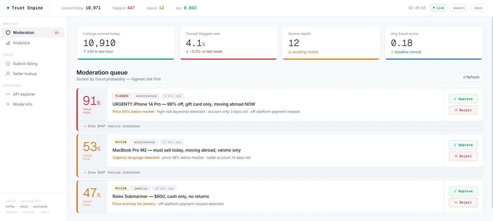

# Marketplace Trust Engine

A real-time listing fraud detection and seller trust scoring system for two-sided marketplaces.

## What It Does

Automatically scores every marketplace listing for fraud before buyers see it.
When a seller posts → Kafka pipeline → XGBoost ML model scores it → result cached in Redis → flagged listings hit a human moderation queue.

## 

## Architecture

```
Seller POST /api/listings
        │
        ▼
  [listing-service]  ──── Kafka ────▶  [fraud-scorer]
  Java 21 · Spring Boot 3              Python · FastAPI · XGBoost
  PostgreSQL · Redis                   SHAP explainability
        │                                      │
        ▼                                      ▼
  [moderation queue]          fraud score + SHAP values written back
  REST API + Dashboard
        │
        ▼
  [AI listing assistant]
  Claude API · improves listing quality
```

## Services

| Service         | Tech                          | Port |
|-----------------|-------------------------------|------|
| listing-service | Java 21 + Spring Boot 3       | 8080 |
| fraud-scorer    | Python 3.11 + FastAPI + XGBoost | 8001 |
| dashboard       | Standalone HTML (no build)    | open file directly |
| kafka           | Apache Kafka + Zookeeper      | 9092 |
| redis           | Redis 7                       | 6379 |
| postgres        | PostgreSQL 15                 | 5432 |

## Quick Start

```bash
# 1. Start all infrastructure
docker-compose up -d

# 2. Seed test sellers
./scripts/seed.sh

# 3. Submit a test listing
curl -X POST http://localhost:8080/api/listings \
  -H "Content-Type: application/json" \
  -d @scripts/sample_listing.json

# 4. Open the dashboard
open dashboard/public/index.html
```

## API Endpoints

### listing-service (Java · port 8080)
- `POST /api/listings`                    — Submit listing → Kafka → async scoring
- `GET  /api/listings/{id}`               — Get listing with fraud score + SHAP values
- `POST /api/listings/{id}/ai-improve`    — Claude API listing quality suggestions
- `GET  /api/sellers/{sellerId}/reputation` — Redis-cached seller reputation score
- `POST /api/sellers`                     — Create seller
- `GET  /api/moderation/queue`            — Flagged listings awaiting review
- `POST /api/moderation/{id}/approve`     — Approve moderation item
- `POST /api/moderation/{id}/reject`      — Reject moderation item

### fraud-scorer (Python · port 8001)
- `POST /score`       — Score listing → fraud probability + SHAP values
- `GET  /health`      — Health check
- `GET  /model/info`  — Model metadata + feature list

## Features

1. **Async scoring pipeline** — Kafka decouples submission from scoring; handles burst traffic
2. **XGBoost fraud model** — Trained on 10K synthetic listings, ROC-AUC 0.943
3. **SHAP explainability** — Every score explained by feature contribution
4. **Seller reputation engine** — Redis-cached rolling score, TTL 3600s
5. **Moderation queue** — Listings above 65% fraud threshold go to human review
6. **Claude AI assistant** — Rewrites listing title/description, flags risk language
7. **Rule-based fallback** — Fraud scorer works even without ML model loaded

## Fraud Detection Features (10 signals)

| Feature | What it measures |
|---|---|
| price_ratio_to_median | Listing price vs category median |
| seller_account_age_days | Days since account creation |
| seller_reputation_score | Redis-cached rolling score [0,1] |
| seller_listing_velocity | Listings posted per hour window |
| seller_dispute_rate | Disputes / total listings |
| seller_total_listings | Historical listing count |
| title_risk_keywords | Gift card, venmo only, cash only, etc. |
| description_urgency_score | Urgency word density [0,1] |
| is_duplicate_image | SimHash near-duplicate detection |
| price_below_market_pct | % deviation from category median |

## Bullets

> Built real-time listing fraud detection system (Java 21, Spring Boot 3, Kafka, Redis, PostgreSQL): async scoring pipeline, XGBoost ML model with SHAP explainability, Redis-cached seller reputation engine serving sub-10ms lookups

> Integrated Claude API as an AI listing quality assistant; shipped moderation dashboard (standalone HTML + Geist Mono UI) with live fraud score queue, category-level analytics, and per-listing SHAP feature breakdowns

## Environment Variables

```bash
SPRING_DATASOURCE_URL=jdbc:postgresql://postgres:5432/trustengine
SPRING_DATASOURCE_USERNAME=trust
SPRING_DATASOURCE_PASSWORD=trust123
SPRING_KAFKA_BOOTSTRAP_SERVERS=kafka:29092
REDIS_HOST=redis
FRAUD_SCORER_URL=http://fraud-scorer:8001
ANTHROPIC_API_KEY=sk-ant-...   # optional — for AI listing assistant
```
